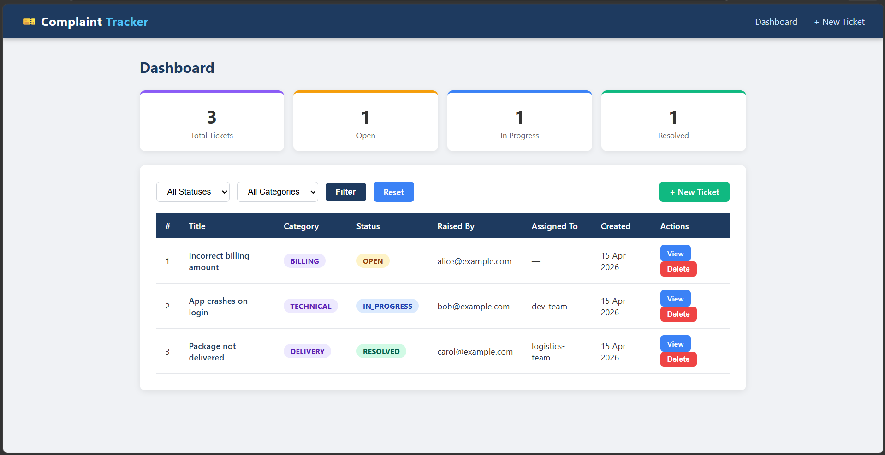
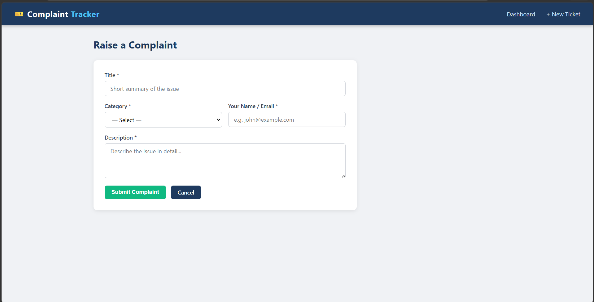
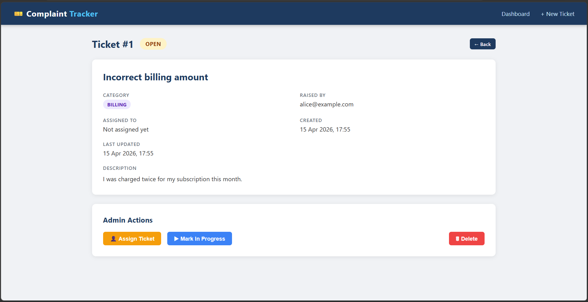
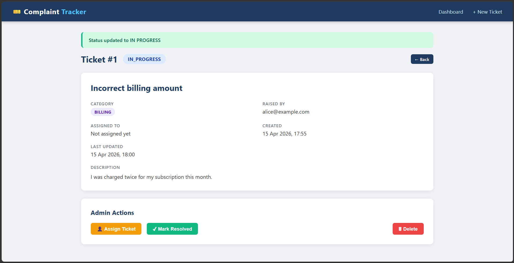

# 🎫 Complaint Ticket Tracker

A full-stack complaint management system built with **Java Spring Boot**, **Spring Security**, **Thymeleaf**, and an **H2 / MySQL database**. Raise complaints, assign them to team members, and track their progress from Open → In Progress → Resolved — with role-based access for Admins and Users.

---

## 📸 Screenshots

### Dashboard

> View all tickets at a glance with live stats, status/category filters, and quick actions.

### Raise a Complaint

> Submit a new complaint with a title, category, description, and your name/email.

### Ticket Detail & Admin Actions

> View full ticket info, assign it to a person or team, advance the status, or delete it.


> Flash messages confirm every action — status updates, assignments, and deletions.

---

## ✨ Features

- 🔐 **Login & Registration** with Spring Security (BCrypt password encoding)
- 👑 **Admin role** — assign tickets, update status, delete tickets
- 👤 **User role** — view tickets and raise new complaints only
- ✅ Submit a complaint with a **title**, **category**, and **description**
- 🔄 Status lifecycle enforced: **Open → In Progress → Resolved** (no skipping, no going back)
- 🔍 **Filter tickets** by status and/or category
- 📊 **Dashboard stats** — total, open, in-progress, and resolved counts
- 🗑️ Delete tickets with confirmation (admin only)
- ⚡ Flash messages for every user action
- 🗄️ H2 in-memory database for local dev, **MySQL** for production
- 🌱 Seed data with default admin and user accounts on startup

---

## 🔐 Role-Based Access

| Feature | 👤 User | 👑 Admin |
|---------|---------|---------|
| Login / Logout | ✅ | ✅ |
| View dashboard & tickets | ✅ | ✅ |
| Submit a new complaint | ✅ | ❌ |
| Assign ticket to a person | ❌ | ✅ |
| Update ticket status | ❌ | ✅ |
| Delete a ticket | ❌ | ✅ |

### Default Accounts (seeded on startup)

| Role | Username | Password |
|------|----------|----------|
| 👑 Admin | `admin` | `admin123` |
| 👤 User | `user` | `user123` |

---

## 🛠️ Tech Stack

| Layer | Technology |
|-------|------------|
| Backend | Java 23, Spring Boot 3.2.4 |
| Security | Spring Security 6 (BCrypt, role-based) |
| Web Layer | Spring MVC (`@Controller`) |
| Frontend | Thymeleaf + Thymeleaf Security Extras + custom CSS |
| Database | H2 In-Memory (dev) / MySQL (production) |
| ORM | Spring Data JPA / Hibernate |
| Validation | Spring Boot Starter Validation |
| Utilities | Lombok |
| Build | Apache Maven 3.x |

---

## 📁 Project Structure

```
src/
└── main/
    ├── java/com/complaint/tickettracker/
    │   ├── TicketTrackerApplication.java
    │   ├── config/
    │   │   └── DataSeeder.java             # Seeds default users + tickets
    │   ├── controller/
    │   │   ├── AuthController.java         # Login & Register pages
    │   │   ├── TicketController.java       # REST API endpoints
    │   │   └── WebController.java          # Thymeleaf page routes
    │   ├── dto/
    │   │   ├── CreateTicketRequest.java
    │   │   ├── AssignTicketRequest.java
    │   │   ├── UpdateStatusRequest.java
    │   │   └── TicketResponse.java
    │   ├── entity/
    │   │   ├── Ticket.java
    │   │   └── User.java                   # App user with role
    │   ├── enums/
    │   │   ├── Role.java                   # ROLE_USER, ROLE_ADMIN
    │   │   ├── TicketStatus.java           # OPEN, IN_PROGRESS, RESOLVED
    │   │   └── TicketCategory.java         # BILLING, TECHNICAL, DELIVERY, ...
    │   ├── exception/
    │   │   ├── GlobalExceptionHandler.java
    │   │   ├── TicketNotFoundException.java
    │   │   └── InvalidStatusTransitionException.java
    │   ├── repository/
    │   │   ├── TicketRepository.java
    │   │   └── UserRepository.java
    │   ├── security/
    │   │   ├── SecurityConfig.java         # Spring Security filter chain & rules
    │   │   └── CustomUserDetailsService.java
    │   └── service/
    │       └── TicketService.java
    └── resources/
        ├── application.properties          # Active profile selector
        ├── application-h2.properties       # H2 config (local dev)
        ├── application-mysql.properties    # MySQL config (production)
        ├── static/css/
        │   └── style.css
        └── templates/
            ├── login.html
            ├── register.html
            ├── index.html                  # Dashboard (role-aware)
            ├── new-ticket.html             # Submit complaint (user only)
            └── ticket-detail.html          # Detail + admin actions
```

---

## 🚀 Getting Started

### Prerequisites

- Java 17+ (project uses Java 23)
- Apache Maven 3.6+
- MySQL (only if using the `mysql` profile)

### Run locally with H2 (default)

```bash
mvn spring-boot:run
```

Or build and run the jar:

```bash
mvn clean package -DskipTests
java -jar target/ticket-tracker-0.0.1-SNAPSHOT.jar
```

App starts on **`http://localhost:8080`** and redirects to the login page.

---

## 🌐 Pages

| URL | Description | Access |
|-----|-------------|--------|
| `http://localhost:8080/login` | Login page | Public |
| `http://localhost:8080/register` | Register new account | Public |
| `http://localhost:8080/` | Dashboard | All logged-in users |
| `http://localhost:8080/tickets/new` | Raise a complaint | User only |
| `http://localhost:8080/tickets/{id}` | Ticket detail + admin actions | All logged-in users |
| `http://localhost:8080/h2-console` | H2 database browser | Dev only |

---

## 🔌 REST API Endpoints

| Method | Endpoint | Description | Role |
|--------|----------|-------------|------|
| `POST` | `/api/tickets` | Submit a new complaint | Any |
| `GET` | `/api/tickets` | Get all tickets | Any |
| `GET` | `/api/tickets?status=OPEN&category=BILLING` | Filter tickets | Any |
| `GET` | `/api/tickets/{id}` | Get a single ticket | Any |
| `PATCH` | `/api/tickets/{id}/assign` | Assign ticket | Admin |
| `PATCH` | `/api/tickets/{id}/status` | Update status | Admin |
| `DELETE` | `/api/tickets/{id}` | Delete ticket | Admin |

### Example — Submit a complaint

```http
POST /api/tickets
Content-Type: application/json

{
  "title": "App not loading",
  "description": "The homepage fails to load on Chrome.",
  "category": "TECHNICAL",
  "raisedBy": "user@example.com"
}
```

### Example — Assign a ticket (admin)

```http
PATCH /api/tickets/1/assign
Content-Type: application/json

{ "assignedTo": "support-team" }
```

### Example — Update status (admin)

```http
PATCH /api/tickets/1/status
Content-Type: application/json

{ "status": "RESOLVED" }
```

---

## 🔄 Status Flow

```
OPEN  ──►  IN_PROGRESS  ──►  RESOLVED
```

- Assigning a ticket automatically advances it from `OPEN` to `IN_PROGRESS`
- Status cannot go backwards or skip a step — enforced at the service layer
- `RESOLVED` is a terminal state
- Only **admins** can change status

---

## 🗄️ H2 Database Console (dev only)

Access at `http://localhost:8080/h2-console`

| Field | Value |
|-------|-------|
| JDBC URL | `jdbc:h2:mem:ticketdb` |
| Username | `sa` |
| Password | *(leave blank)* |

---

## 🐬 Switch to MySQL (Production)

**1. Change the active profile** in `application.properties`:

```properties
spring.profiles.active=mysql
```

**2. Update credentials** in `application-mysql.properties` or use environment variables:

```bash
DB_USERNAME=root
DB_PASSWORD=yourpassword
```

**3. Create the database** in MySQL:

```sql
CREATE DATABASE ticketdb;
```

Spring Boot will auto-create the tables on first run (`ddl-auto=update`).

---

## 🌱 Seed Data

Loaded automatically on startup:

### Users

| Username | Password | Role |
|----------|----------|------|
| `admin` | `admin123` | ADMIN |
| `user` | `user123` | USER |

### Tickets

| # | Title | Category | Status | Assigned To |
|---|-------|----------|--------|-------------|
| 1 | Incorrect billing amount | BILLING | OPEN | — |
| 2 | App crashes on login | TECHNICAL | IN_PROGRESS | dev-team |
| 3 | Package not delivered | DELIVERY | RESOLVED | logistics-team |

---

## 📦 Available Categories

`BILLING` · `TECHNICAL` · `DELIVERY` · `PRODUCT` · `SERVICE` · `OTHER`

---

## 📄 License

This project is open source and available under the [MIT License](LICENSE).
